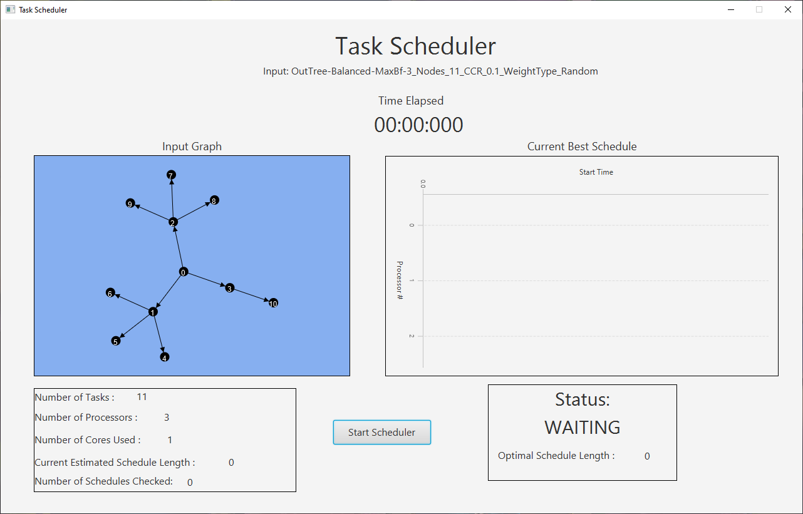
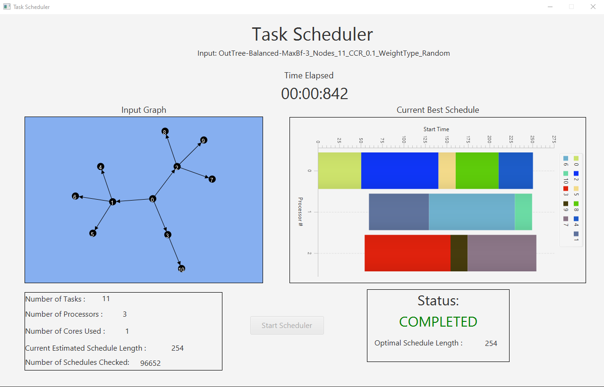

# SE306 Project 1 - Team 1 : Outsourced to Pakistan

### Note to the Markers
There have been some issues which show up depending on what operating system the jar is being run on. To ensure that the runnable jar works, please run using Ubuntu1804LTS on FlexIT.

## Team Members
* Adam Sinclair
* Henry Man
* Osama Kashif
* Remus Courtenay
* Syed Ahmad Kazmi

# Project Outline
For this project, we have been tasked with developing a program used to schedule a certain number of tasks over a certain number of processors whilst
keeping to a list of constraints. The project included the following two milestones.

## Milestone 1
Milestone 1 requires that we develop a scheduler which is able to return a valid schedule. A valid schedule refers to a schedule for the tasks which
keeps to the constraints, but is not necessarily the most optimal solution. The runnable jar for our Milestone 1 release can be found [here](https://github.com/SoftEng306-2021/project-1-p1t16-outsourced-to-pakistan/releases/tag/v1.0)

## Milestone 2
Milestone 2 requires that we develop a scheduler which is able to return a schedule which is not only valid, but is also optimal. A schedule is optimal if it has the shortest possible finishing time, whilst adhering to all the constraints. We are also required to develop a meaningful visualisation, as well as the option to parallelize the search by running the algorithm on multiple threads. For the scheduling algorithm, we used an A* searching algorithm with various pruning techniques. The runnable jar for our Milestone 2 release can be found [here](https://github.com/SoftEng306-2021/project-1-p1t16-outsourced-to-pakistan/releases/tag/2.0)

# Running the program
Before running the program, check that the runnable jar along with the input DOT file are located in the same folder. The runnable 
jar files can be found on the [Releases](https://github.com/SoftEng306-2021/project-1-p1t16-outsourced-to-pakistan/releases) page.

To run the jar files, run the follow command in the terminal: 
```
java [-Xmx4G] -jar scheduler.jar INPUT.dot P [OPTION]
```
COMPULSORY ARGUMENTS:
* ```INPUT.dot```: a directed acyclic task graph with integer weights using the DOT file format.
* ```P```: the number of processors available to schedule tasks on

OPTIONAL ARGUMENTS:
* ```-o OUTPUT```: name of output file (default name is INPUT-output.dot)
* ```-v ```: Turns on visualization
* ```-p NUM_THREADS```: Number of threads to execute parallel algorithm on

Once the program has completed execution, the output file will be generated in the same folder

# Displaying the Program GUI

To display the program with the GUI you have to use the `-v` option.
```
java [-Xmx4G] -jar scheduler.jar INPUT.dot P [OPTION] -v
```

Initially the scheduler shows the graph along with some other information such as number of tasks, processors and cores used. However, some values are 0 and no schedule is shown until the scheduler is started.



Click `Start Scheduler` to start the scheduler.
Once the Scheduler has started, it will stop when it has found the optimal schedule. During the running period the schedule can be seen changing along with the values of the estimate length and schedules checked. 
Once it is done, we can see the final estimated length, the number of schedules checked, the optimal schedule length, as well as the optimal schedule.



# Building and Compiling
The project has been built for Java 1.8, check your current java version before running the code using:
```
java -version
```

Building the project requires the use of the package manager Maven. To check if Maven has been installed, use:
```
mvn -v
```

To compile the project, navigate to the root directory of the project, and run:
```
mvn package
```

This will generate a runnable jar called ```scheduler.jar```. Instructions for running the jar can be found in the above section.

# Acknowledgements
* [Graphstream](https://graphstream-project.org/)
* [Commons CLI](https://commons.apache.org/proper/commons-cli/)
* [Sandeep Gupta - MurmurHash](https://github.com/sangupta/murmur)
* [JUnit 5](https://junit.org/junit5/docs/current/user-guide/#overview)
* [Maven Surefire Plugin](https://maven.apache.org/surefire/maven-surefire-plugin/#)
* [Reducing the solution space of optimal task scheduling](https://www.sciencedirect.com/science/article/abs/pii/S0305054813002542?via%3Dihub)
* [Optimal Scheduling of Task Graphs on Parallel Systems](https://ieeexplore.ieee.org/document/4710998)
